### 리플렉션

자바의 리플렉션 기술을 이용하면, 클래스나 메서드의 메타정보를 동적으로 획득하고,
코드도 동적으로 호출 할 수 있다.


### 아래 코드
- 공통로직 1과 로직 2 는 호출하는 메서드만 다르고 전체 코드 흐름이 완전히 같다.
  - 먼저 start 로그를 출력한다.
  - 어떤 메서드를 호출한다.
  - 메서드의 호출 결과를 로그로 출력한다.
- 여기서 공통 로직1 과 공통 로직2 를 하나의 메서드로 뽑아서 합칠 수 있다.
- target.callA() 와 target.callB() 부분만 동적으로 처리 할 수 있다면 ...?
```java
    @Test
    void reflection0() {
        Hello target = new Hello();

        // 공통 로직 1 시작
        log.info("start");
        String result1 = target.callA(); // 호출하는 메서드가 다름
        log.info("result={}", result1);
        // 공통 로직1 종료

        // 공통 로직 2 시작
        log.info("start");
        String result2 = target.callB(); // 호출하는 메서드가 다름
        log.info("result={}", result2);
        // 공통 로직2 종료

    }
```


```java
    @Test
    void reflection1() throws Exception {
        // 클래스 정보 -> 클래스 메타정보를 획득한다. 내부 클래스는 구분을 위해 $ (달라) 를 사용.
        Class classHello = Class.forName("hello2.proxy.jdkdynamic.ReflectionTest$Hello");

        Hello target = new Hello();
        // callA 메서드 정보 -> getMethod ( 메소드 메타정보를 획득 ) methodCallA 는 Method 자체의 메타라 보면 된다.
        Method methodCallA = classHello.getMethod("callA");
        // 획득한 메타정보로 실제 인스턴스의 메서드를 호출한다.
        Object result1 = methodCallA.invoke(target);
        
        log.info("result1={}", result1);

        // callA 메서드 정보
        Method methodCallB = classHello.getMethod("callB");
        Object result2 = methodCallB.invoke(target);
        log.info("result1={}", result2);
    }
```
### 쉽게 이해하기 위해...
- 필요한 재료 : 클래스의 메타정보, 클래스의 메서드 정보 (Hello 라는 클래스 안에 callA 메서드가 있다고 가정.)
  - STEP1 클래스의 메타정보를 가져온다. Class classHello = Class.forName("package 주소 따라라라라.$해당클래스")
  - STEP2 Hello target = new Hello(); 생성자 호출로 인스턴스를 만들어 놓는다.
  - STEP3 메서드 정보를 얻어온다 (문자로) -> Method methodCallA = classHello.getMethod("callA")
  - STEP4 동적으로 Call 한다. -> methodCallA.invoke(target); // 만들어둔 인스턴스에 있는 callA 메서드를 호출한다.
---
- 여기서 제일 중요한점은 클래스나 메서드 정보를 동적으로 변경할 수 있다는 점.
- 영한님이 말씀하시기를, 리플렉션을 사용하면, 클래스와 메서드의 메타정보를
- 사용해서 어플리케이션을 동적으로 유연하게 만들 수 있다고 하셨다.
- 그러나 리플렉션 기술은 런타임에 동작하기 때문에, 컴파일 시점에 오류를 잡을 수 없다.
- 예를 들어 지금까지 살펴본 코드에서 getMethod("callA") 안에 들어가는 문자를 실수로 작성해도 
- 컴파일 오류가 발생한다.
- 가장 좋은 오류는 개발자가 즉시 확인할 수 있는 컴파일 오류이고, 가장 무서운 오류는 사용자가 직접 실행할ㄷ 때 발생하는 런타임 오류다.
- 따라서 리플렉션은 일반적으로 사용하면 안된다. 프레임워크를 역행하는 꼴.


- 정리
  - 리플렉션은 프레임워크 개발이나 또는 매우 일반적인 공통 처리가 필요할 때 부분적으로 주의해서 사용해야 한다.
    - 메서드의 메타정보를 얻고 , 동적으로 바꿔가면서 호출하ㅓㄴ다.
  - JDK 동적 프록시
    - 일일히 프록시를 만들어주는게 아니라, 동적으로 프록시를 생성.
    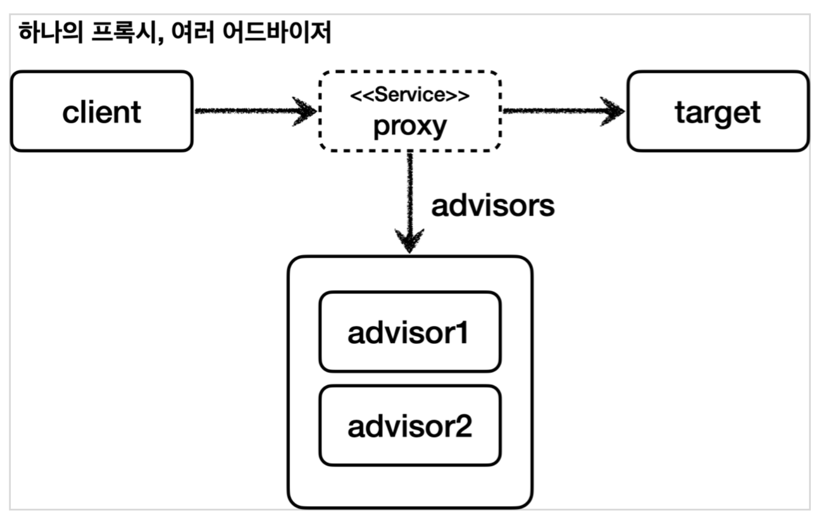
  - CGLIB 구체클래스를 상속받아 프록시를 만들 수 있다.
    - 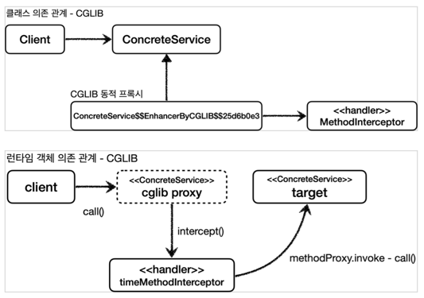


### Spring 프록시 팩토리 ! 
  - 인터페이스가 있으면 -> JDK 동적 프록시를 사용하고,
  - 구체 클래스가 있으면 -> CGLIB 를 사용한다.
  - 그리고 이 설정도 변경 가능하다.
  - 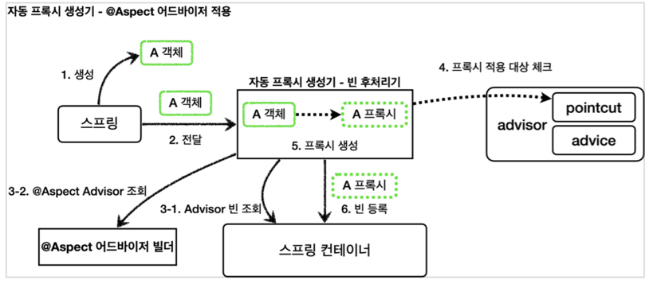
  - 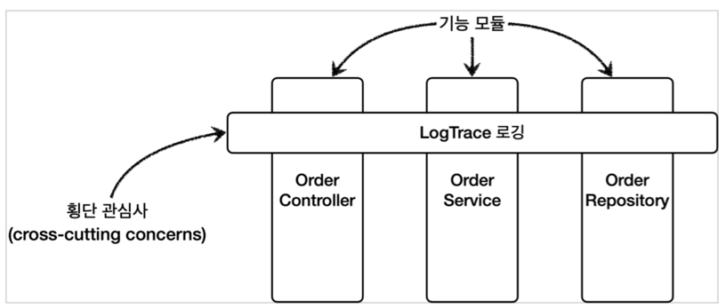
  - 두 기술을 함께 사용할 때 부가 기능을 적용하기 위해 Spring 에서 Advice 라는 개념을 도입했다.
  - 개발자는 InvocationHandler 나 MethodInterceptor 를 신경 쓰기 않아두 된다.
  - 
  - 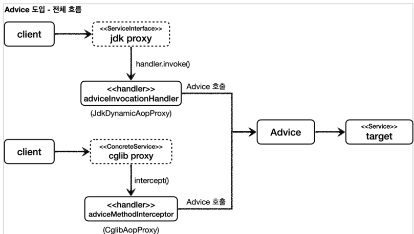


---

- 포인트컷 : 어디에다가 부가기능을 추가할지 말지의 필터링 로직.
  - 주로 클래스와 메서드 이름으로 필터링 한다. 이름 그대로 어떤 포인트 (point) 에 기능을 적용할지, 않을지 잘라서 (cut) 구분한다.
- 어드바이스: 프록시가 호출하는 부가 기능. ( 단순하게 프록시 로직 )
- 어드바이저: 단순하게 하나의 포인트컷과 하나의 어드바이스를 가지고 있는 것.
  - 쉽게 말해 포인트컷 + 1 어드바이스 + 1 이다. ( 포인트컷 + 2개 는 어드바이스 + 2개)
   
정리: 포인트컷으로 부가 기능 로직을 어디에? 적용할지 선택하고, 어드바이스로 어떤 로직을 적용할지 선택하는것.
조언자: Advisor, 어디: PointCut, 조언: Advice
조언자는 어디에 조언을 해야할지 알고 있다.

포인트컷은 대상 여부를 확인하는 필터 역할만 담당하고, 어드바이스는 깔끔하게 부가 기능 로직만 담당한다. 둘을 합치면 어드바이저가 된다.
스프링의 어드바이저는 하나의 포인트컷 + 하나의 어드바이스로 구성된다.

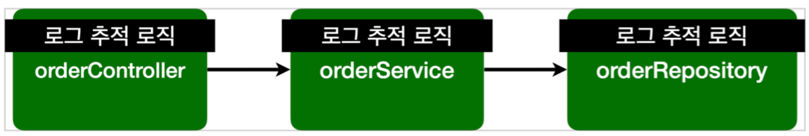


```java
    @Test
    void advisorTest1() {
        ServiceInterface target = new ServiceImpl();
        ProxyFactory proxyFactory = new ProxyFactory(target);
        /* 
        `Advisor` 인터페이스의 가장 일반적인 구현체이다. 생성자를 통해 하나의 포인트컷과 하나의 어드바이스를 넣어주면 된다. 어드바이저는 하나의 포인트컷과 하나의 어드바이스로 구성된다.
        Pointcut.TRUE: 항상 true 를 반환하는 포인트컷이다. 이후에 직접 포인트컷을 구현해볼 것이다.
        */
        DefaultPointcutAdvisor advisor = new DefaultPointcutAdvisor(Pointcut.TRUE, new TimeAdvice());
        
        proxyFactory.addAdvisor(advisor);
        ServiceInterface proxy = (ServiceInterface) proxyFactory.getProxy();

        proxy.save();
        proxy.find();
    }
```

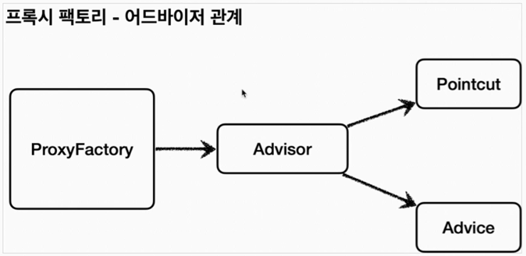

### 스프링이 제공하는 PointCut 사용시

```java
    @Test
    @DisplayName("스프링이 제공하는 포인트컷")
    void advisorTest3() {
        ServiceInterface target = new ServiceImpl();
        ProxyFactory proxyFactory = new ProxyFactory(target);
        final NameMatchMethodPointcut pointcut = new NameMatchMethodPointcut(); // Spring 이 제공하는 포인트컷
        pointcut.setMappedName("save"); // method 이름이 save 인 경우에
        DefaultPointcutAdvisor advisor = new DefaultPointcutAdvisor(pointcut, new TimeAdvice());
        proxyFactory.addAdvisor(advisor);
        ServiceInterface proxy = (ServiceInterface) proxyFactory.getProxy();

        proxy.save();
        proxy.find();
    }
```
- new NameMatchMethodPointcut(); 인스턴스를 생성해 pointcut 변수.setMappedName 에 "save" 를 지정해주자
- proxy.save(); // save 는 호출가능 
- proxy.find(); // find 는 호출불가인데, 지금은 단건만 가능하다.
- 둘다 호출은 지금상황에서 불가하다.
- 그림 으로 확인시, 아래와 같다.
  - 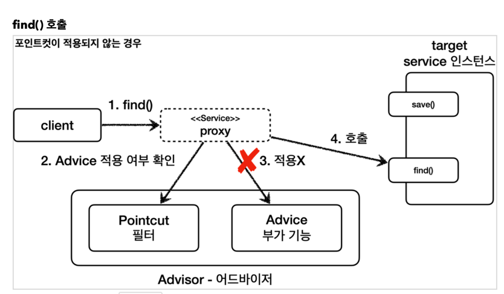
- 어드바이저는 하나의 포인트컷과 하나의 어드바이스를 가지고있다, 하나의 target 에 여러 어드바이스를 적용해야 한다면.
  - 현재 방법에서는 프록시를 여러개 만들면 된다.
  - 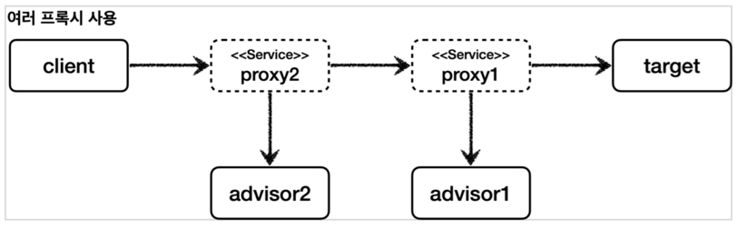

```java

@Test
@DisplayName("여러 프록시")
    void multiAdvisorTest1() {
            // client -> proxy2(advisor2) -> proxy1(advisor1) -> target

            // 프록시 1 생성
            ServiceInterface target = new ServiceImpl();
            ProxyFactory proxyFactory = new ProxyFactory(target);
            DefaultPointcutAdvisor advisor1 = new DefaultPointcutAdvisor(Pointcut.TRUE, new Advice1());
            proxyFactory.addAdvisor(advisor1);
            ServiceInterface proxy1 = (ServiceInterface) proxyFactory.getProxy();

            // 프록시 2 생성 target -> proxy1 입력
            ProxyFactory proxyFactory2 = new ProxyFactory(proxy1);
            DefaultPointcutAdvisor advisor2 = new DefaultPointcutAdvisor(Pointcut.TRUE, new Advice2());
            proxyFactory2.addAdvisor(advisor2);
            ServiceInterface proxy2 = (ServiceInterface) proxyFactory2.getProxy();

            // 실행
            proxy2.save();
            }

static class Advice1 implements MethodInterceptor {

  @Override
  public Object invoke(final MethodInvocation invocation) throws Throwable {
    log.info("advice1 호출");
    return invocation.proceed();
  }
}

static class Advice2 implements MethodInterceptor {

  @Override
  public Object invoke(final MethodInvocation invocation) throws Throwable {
    log.info("advice2 호출");
    return invocation.proceed();
  }
}

```
- 여러개 만들었더니 문제가 생겼다.
- 프록시를 n번 호출하는데 부담스럽다.
- 하나의 프록시에 여러 어드바이저를 만들수 있는 방법은 없을까 하면 역시 갓 스프링.
- 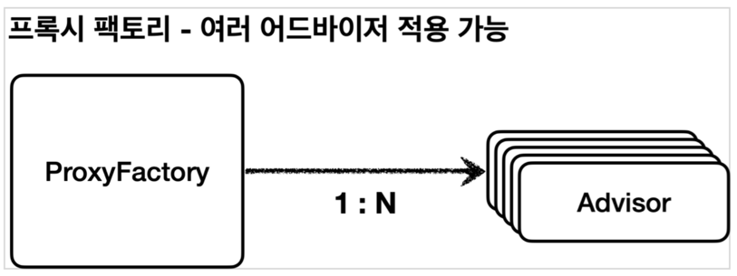

```java
    @Test
    @DisplayName("하나의 프록시, 여러 어드바이저")
    void multiAdvisorTest2() {
        // client -> proxy -> advisor2 -> advisor1 -> target
        DefaultPointcutAdvisor advisor1 = new DefaultPointcutAdvisor(Pointcut.TRUE, new Advice1());
        DefaultPointcutAdvisor advisor2 = new DefaultPointcutAdvisor(Pointcut.TRUE, new Advice2());

        ServiceInterface target = new ServiceImpl();
        ProxyFactory proxyFactory = new ProxyFactory(target);

        proxyFactory.addAdvisor(advisor2); // 2번 어드바이저
        proxyFactory.addAdvisor(advisor1); // 1번 어드바이저
        
        ServiceInterface proxy = (ServiceInterface) proxyFactory.getProxy();

        // 실향
        proxy.save();
    }
```
- 약간 허무하다.
- addAdvisor 에 2개 를 등록해주면 된다.
- 원하는만큼 등록하는 순서대로 advisor 가 호출된다.
- 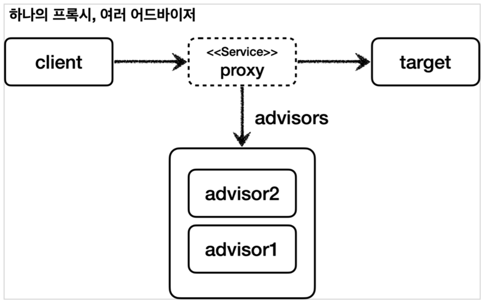
- 여기서 정말 중요한게, 스프링은 AOP 를 적용할때, 최적화를 진행해서 하나만 만들고, 하나의 프록시에 여러 어드바이저를 적용한다.
- 정리하면, 하나의 target 에 여러 AOP 가 적용되어도, 스프링의 AOP 는 target 마다 하나의 프록시만 생성한다.

이미지, 지식 출처 - 김영한 스프링-핵심-원리-PDF
