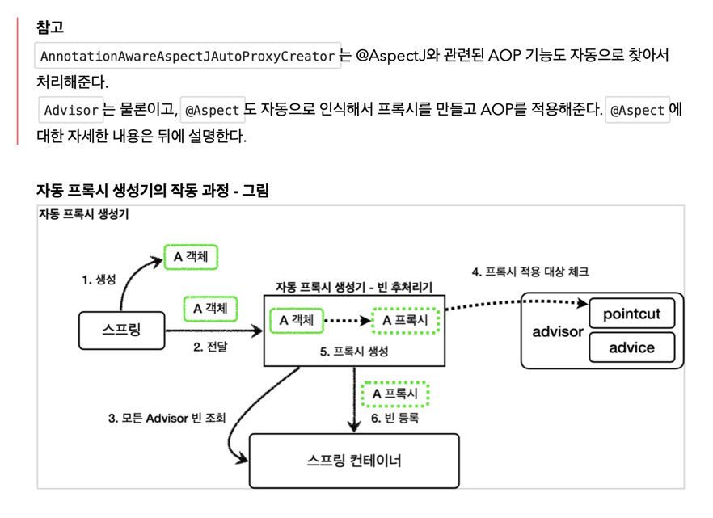
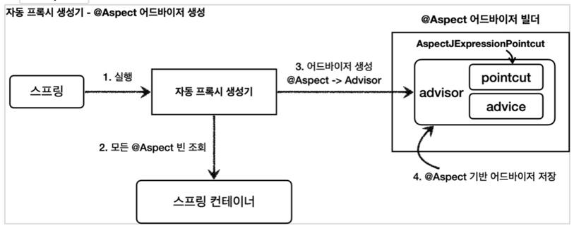

### 리플렉션

자바의 리플렉션 기술을 이용하면, 클래스나 메서드의 메타정보를 동적으로 획득하고,
코드도 동적으로 호출 할 수 있다.

### 아래 코드
- 공통로직 1과 로직 2 는 호출하는 메서드만 다르고 전체 코드 흐름이 완전히 같다.
  - 먼저 start 로그를 출력한다.
  - 어떤 메서드를 호출한다.
  - 메서드의 호출 결과를 로그로 출력한다.
- 여기서 공통 로직1 과 공통 로직2 를 하나의 메서드로 뽑아서 합칠 수 있다.
- target.callA() 와 target.callB() 부분만 동적으로 처리 할 수 있다면 ...?
```java
    @Test
    void reflection0() {
        Hello target = new Hello();

        // 공통 로직 1 시작
        log.info("start");
        String result1 = target.callA(); // 호출하는 메서드가 다름
        log.info("result={}", result1);
        // 공통 로직1 종료

        // 공통 로직 2 시작
        log.info("start");
        String result2 = target.callB(); // 호출하는 메서드가 다름
        log.info("result={}", result2);
        // 공통 로직2 종료

    }
```


```java
    @Test
    void reflection1() throws Exception {
        // 클래스 정보 -> 클래스 메타정보를 획득한다. 내부 클래스는 구분을 위해 $ (달라) 를 사용.
        Class classHello = Class.forName("hello2.proxy.jdkdynamic.ReflectionTest$Hello");

        Hello target = new Hello();
        // callA 메서드 정보 -> getMethod ( 메소드 메타정보를 획득 ) methodCallA 는 Method 자체의 메타라 보면 된다.
        Method methodCallA = classHello.getMethod("callA");
        // 획득한 메타정보로 실제 인스턴스의 메서드를 호출한다.
        Object result1 = methodCallA.invoke(target);
        
        log.info("result1={}", result1);

        // callA 메서드 정보
        Method methodCallB = classHello.getMethod("callB");
        Object result2 = methodCallB.invoke(target);
        log.info("result1={}", result2);
    }
```
### 쉽게 이해하기 위해...
- 필요한 재료 : 클래스의 메타정보, 클래스의 메서드 정보 (Hello 라는 클래스 안에 callA 메서드가 있다고 가정.)
  - STEP1 클래스의 메타정보를 가져온다. Class classHello = Class.forName("package 주소 따라라라라.$해당클래스")
  - STEP2 Hello target = new Hello(); 생성자 호출로 인스턴스를 만들어 놓는다.
  - STEP3 메서드 정보를 얻어온다 (문자로) -> Method methodCallA = classHello.getMethod("callA")
  - STEP4 동적으로 Call 한다. -> methodCallA.invoke(target); // 만들어둔 인스턴스에 있는 callA 메서드를 호출한다.
---
- 여기서 제일 중요한점은 클래스나 메서드 정보를 동적으로 변경할 수 있다는 점.
- 영한님이 말씀하시기를, 리플렉션을 사용하면, 클래스와 메서드의 메타정보를
- 사용해서 어플리케이션을 동적으로 유연하게 만들 수 있다고 하셨다.
- 그러나 리플렉션 기술은 런타임에 동작하기 때문에, 컴파일 시점에 오류를 잡을 수 없다.
- 예를 들어 지금까지 살펴본 코드에서 getMethod("callA") 안에 들어가는 문자를 실수로 작성해도 
- 컴파일 오류가 발생한다.
- 가장 좋은 오류는 개발자가 즉시 확인할 수 있는 컴파일 오류이고, 가장 무서운 오류는 사용자가 직접 실행할ㄷ 때 발생하는 런타임 오류다.
- 따라서 리플렉션은 일반적으로 사용하면 안된다. 프레임워크를 역행하는 꼴.


- 정리
  - 리플렉션은 프레임워크 개발이나 또는 매우 일반적인 공통 처리가 필요할 때 부분적으로 주의해서 사용해야 한다.
    - 메서드의 메타정보를 얻고 , 동적으로 바꿔가면서 호출한다.
  - JDK 동적 프록시
    - 일일히 프록시를 만들어주는게 아니라, 동적으로 프록시를 생성.
    
  - CGLIB 구체클래스를 상속받아 프록시를 만들 수 있다.
    - 


### Spring 프록시 팩토리 ! 
  - 인터페이스가 있으면 -> JDK 동적 프록시를 사용하고,
  - 구체 클래스가 있으면 -> CGLIB 를 사용한다.
  - 그리고 이 설정도 변경 가능하다.
  - 
  - 
  - 두 기술을 함께 사용할 때 부가 기능을 적용하기 위해 Spring 에서 Advice 라는 개념을 도입했다.
  - 개발자는 InvocationHandler 나 MethodInterceptor 를 신경 쓰지 않아도 된다.
  - 
  - 


---

- 포인트컷 : 어디에다가 부가기능을 추가할지 말지의 필터링 로직.
  - 주로 클래스와 메서드 이름으로 필터링 한다. 이름 그대로 어떤 포인트 (point) 에 기능을 적용할지, 않을지 잘라서 (cut) 구분한다.
- 어드바이스: 프록시가 호출하는 부가 기능. ( 단순하게 프록시 로직 )
- 어드바이저: 단순하게 하나의 포인트컷과 하나의 어드바이스를 가지고 있는 것.
  - 쉽게 말해 포인트컷 + 1 어드바이스 + 1 이다. ( 포인트컷 + 2개 는 어드바이스 + 2개)
   
정리: 포인트컷으로 부가 기능 로직을 어디에? 적용할지 선택하고, 어드바이스로 어떤 로직을 적용할지 선택하는것.
조언자: Advisor, 어디: PointCut, 조언: Advice
조언자는 어디에 조언을 해야할지 알고 있다.

포인트컷은 대상 여부를 확인하는 필터 역할만 담당하고, 어드바이스는 깔끔하게 부가 기능 로직만 담당한다. 둘을 합치면 어드바이저가 된다.
스프링의 어드바이저는 하나의 포인트컷 + 하나의 어드바이스로 구성된다.


```java
    @Test
    void advisorTest1() {
        ServiceInterface target = new ServiceImpl();
        ProxyFactory proxyFactory = new ProxyFactory(target);
        /* 
        `Advisor` 인터페이스의 가장 일반적인 구현체이다. 생성자를 통해 하나의 포인트컷과 하나의 어드바이스를 넣어주면 된다. 어드바이저는 하나의 포인트컷과 하나의 어드바이스로 구성된다.
        Pointcut.TRUE: 항상 true 를 반환하는 포인트컷이다. 이후에 직접 포인트컷을 구현해볼 것이다.
        */
        DefaultPointcutAdvisor advisor = new DefaultPointcutAdvisor(Pointcut.TRUE, new TimeAdvice());
        
        proxyFactory.addAdvisor(advisor);
        ServiceInterface proxy = (ServiceInterface) proxyFactory.getProxy();

        proxy.save();
        proxy.find();
    }
```


### 스프링이 제공하는 PointCut 사용시

```java
    @Test
    @DisplayName("스프링이 제공하는 포인트컷")
    void advisorTest3() {
        ServiceInterface target = new ServiceImpl();
        ProxyFactory proxyFactory = new ProxyFactory(target);
        final NameMatchMethodPointcut pointcut = new NameMatchMethodPointcut(); // Spring 이 제공하는 포인트컷
        pointcut.setMappedName("save"); // method 이름이 save 인 경우에
        DefaultPointcutAdvisor advisor = new DefaultPointcutAdvisor(pointcut, new TimeAdvice());
        proxyFactory.addAdvisor(advisor);
        ServiceInterface proxy = (ServiceInterface) proxyFactory.getProxy();

        proxy.save();
        proxy.find();
    }
```
- new NameMatchMethodPointcut(); 인스턴스를 생성해 pointcut 변수.setMappedName 에 "save" 를 지정해주자
- proxy.save(); // save 는 호출가능 
- proxy.find(); // find 는 호출불가인데, 지금은 단건만 가능하다.
- 둘다 호출은 지금상황에서 불가하다.
- 그림 으로 확인시, 아래와 같다.
  - 
- 어드바이저는 하나의 포인트컷과 하나의 어드바이스를 가지고있다, 하나의 target 에 여러 어드바이스를 적용해야 한다면.
  - 현재 방법에서는 프록시를 여러개 만들면 된다.
  - 

```java

@Test
@DisplayName("여러 프록시")
    void multiAdvisorTest1() {
            // client -> proxy2(advisor2) -> proxy1(advisor1) -> target

            // 프록시 1 생성
            ServiceInterface target = new ServiceImpl();
            ProxyFactory proxyFactory = new ProxyFactory(target);
            DefaultPointcutAdvisor advisor1 = new DefaultPointcutAdvisor(Pointcut.TRUE, new Advice1());
            proxyFactory.addAdvisor(advisor1);
            ServiceInterface proxy1 = (ServiceInterface) proxyFactory.getProxy();

            // 프록시 2 생성 target -> proxy1 입력
            ProxyFactory proxyFactory2 = new ProxyFactory(proxy1);
            DefaultPointcutAdvisor advisor2 = new DefaultPointcutAdvisor(Pointcut.TRUE, new Advice2());
            proxyFactory2.addAdvisor(advisor2);
            ServiceInterface proxy2 = (ServiceInterface) proxyFactory2.getProxy();

            // 실행
            proxy2.save();
            }

static class Advice1 implements MethodInterceptor {

  @Override
  public Object invoke(final MethodInvocation invocation) throws Throwable {
    log.info("advice1 호출");
    return invocation.proceed();
  }
}

static class Advice2 implements MethodInterceptor {

  @Override
  public Object invoke(final MethodInvocation invocation) throws Throwable {
    log.info("advice2 호출");
    return invocation.proceed();
  }
}

```
- 여러개 만들었더니 문제가 생겼다.
- 프록시를 n번 호출하는데 부담스럽다.
- 하나의 프록시에 여러 어드바이저를 만들수 있는 방법은 없을까 하면 역시 갓 스프링.
- 

```java
    @Test
    @DisplayName("하나의 프록시, 여러 어드바이저")
    void multiAdvisorTest2() {
        // client -> proxy -> advisor2 -> advisor1 -> target
        DefaultPointcutAdvisor advisor1 = new DefaultPointcutAdvisor(Pointcut.TRUE, new Advice1());
        DefaultPointcutAdvisor advisor2 = new DefaultPointcutAdvisor(Pointcut.TRUE, new Advice2());

        ServiceInterface target = new ServiceImpl();
        ProxyFactory proxyFactory = new ProxyFactory(target);

        proxyFactory.addAdvisor(advisor2); // 2번 어드바이저
        proxyFactory.addAdvisor(advisor1); // 1번 어드바이저
        
        ServiceInterface proxy = (ServiceInterface) proxyFactory.getProxy();

        // 실향
        proxy.save();
    }
```
- 약간 허무하다.
- addAdvisor 에 2개 를 등록해주면 된다.
- 원하는만큼 등록하는 순서대로 advisor 가 호출된다.
- 
- 여기서 정말 중요한게, 스프링은 AOP 를 적용할때, 최적화를 진행해서 하나만 만들고, 하나의 프록시에 여러 어드바이저를 적용한다.
- 정리하면, 하나의 target 에 여러 AOP 가 적용되어도, 스프링의 AOP 는 target 마다 하나의 프록시만 생성한다.

- @Import(ProxyFactoryConfigV2.class)  V1 과 V2 의 차이점은 interface 냐, 구체클래스 기반으로 proxyFactory 를 구현했는지 차이다.
- 프록시 팩토리 덕분에 개발자는 매우 편리하게 프록시를 생성 할 수 있게 됬다.
- 추가로 어드바이저, 어드바이스, 포인트컷 이라는 개념덕분에 "어떤 부가 기능" 을 "어디에 적용" 할 지 명확하게 이해 할 수 있다.

### 남은 문제
- 프록시 팩토리와 어드바이저 같은 개념 덕분에 지금까지 고민했던 문제들은 해결되었다. 프록시도 깔끔하게 적요하고 포인트컷으로 어디에 부가기능을 적용할지도 명확하게 정의할 수 있었다. 원본 코드를 전혀 손대지 않고 프록시를 통해 부가 기능도 적용할 수 있었다.
- 그러나 아직 해결되지 않는 문제가 있다.

### 문제 1 - 너무 많은 설정 
- 바로 ProxyFactoryConfigV1, ProxyFactoryConfigV2 와 같은 설정 파일이 지나치게 망ㅎ다는 점이다.
- 예를들어, 에플리케이션에 스프링 빈이 100개가 있다면 여기에 프록시를 통해 부가 기능을 적용하려면 100 개의 도엊ㄱ 프록시 생성코드를 만들어야 한다!
- 최근까진 스프링 빈을 등록하기 귀찮아서 컴포넌트 스캔까지 사용하는데, 이렇게 직접 등록하는 것도 모자라서, 프록시를 적용하는  코드까지 빈 생성 코드에 넣어야 했다.

### 문제 2 - 컴포넌트 스캔
- 애플리케이션 V3 처럼 컴포넌트 스캔을 사용하는 경우 지ㅐ금까지 학습한 방법으로는 프록시 적용이 불가능하다.
- 왜냐하면 실제 객체를 컴포넌트 스캔으로 스프링 컨테이너에 스프링 빈으로 등록을 다 해버린 상태이기 떄문이다.
- 지금까지 학습한 프록시를 적용하려면, 실제 객체를 스프링 컨테이너에 빈으로 등록하는것이 아니라 ProxyFactoryConfigV1 에서 한것처럼, 부가 기능이 있는 프록시를 실제 객체 대신 스프링 컨테이너에 빈으로 등록해야 한다.

### 두가지 문제를 한번에 해결하는 방법이 빈 후처리기 이다.

### 빈 후처리기


- @Bean 이나 컴포넌트 스캔으로 스프링 빈을 등록하면, 스프링은 대상 객체를 생성하고 스프링 컨테이너 내부의 빈 저장소에 등록한다. 그리고 이후에는 스프링 컨테이너를 통해 등록한 스프링 빈을 조회해서 사용하면 된다.
  - 빈 후처리기 - BeanPostProcessor
    > 스프링이 빈 저장소에 등록할 목적으로 생성한 객체를 빈 저장소에 등록하기 직전에 조작하고 싶다면 빈 후처리기를 사용하면 된다.
  빈 포스트 프로세서( BeanPostProcessor )는 번역하면 빈 후처리기인데, 이름 그대로 빈을 생성한 후에 무언가를 처리하는 용도로 사용한다.
  이미지, 지식 출처 - 김영한 스프링-핵심-원리-PDF

```java

public class BasicTest {

    @Test
    void basicConfig() {
        ApplicationContext applicationContext = new AnnotationConfigApplicationContext(BasicConfig.class);

        // A는 빈으로 등록된다.
        A a = applicationContext.getBean("beanA", A.class);
        a.helloA();

        // B 는 빈으로 등록되지 않는다.
        Assertions.assertThrows(NoSuchBeanDefinitionException.class, () -> applicationContext.getBean(B.class));
    }

    @Slf4j
    @Configuration
    static class BasicConfig {
        @Bean(name= "beanA")
        public A a() {
            return new A();
        }
    }

    @Slf4j
    static class A {
        public void helloA() {
            log.info("hello A");
        }
    }

    @Slf4j
    static class B {
        public void helloB() {
            log.info("hello B");
        }
    }

}
```

### 위의 예제는 간단한 빈 확인 예제이다.
1. 잠깐. new AnnotationConfigApplicationContext() 를 잠시 짚고 넘어가자.
  - AnnotationConfigApplicationContext는 자바 설정에서 정보를 읽어와 빈 객체를 생성, 관리한다.
  - AnnotationConfigApplicationContext는 AppContext에 정의한 @Bean 설정 정보를 읽어와 Greeter 객체를 생성, 초기화한다.
2. [1] 번에서 Bean BasicConfig 클래스를 등록했다. @Configuration 을 사용함으로써 스프링 컨테이너에 등록된다.

- @Bean 이나 컴포넌트 스캔으로 스프링 빈을 등록하면, 스프링은 대상 객체를 생성하고 스프링 컨테이너 내부의 빈 저장소에 등록한다. 그리고 이후에는 스프링 컨테이너를 통해 등록한 스프링 빈을 조회해서 사용하면 된다.

### 빈 후처리기 - BeanPostProcessor
  - 스프링이 빈 저장소에 등록할 목적으로 생성한 객체를 빈 저장소에 등록하기 직전에 조작하고 싶다면 빈 후처리기를 사용하면 된다.
  빈 포스트 프로세서( BeanPostProcessor )는 번역하면 빈 후처리기인데, 이름 그대로 빈을 생성한 후에 무언가를 처리하는 용도로 사용한다.

```java
public class BeanPostProcessorTest {

    @Test
    void basicConfig() {
        ApplicationContext applicationContext = new AnnotationConfigApplicationContext(BasicPostProcessorConfig.class);

        // beanA 이름으로 B 객체가 등록된다.
        B b = applicationContext.getBean("beanA", B.class);
        b.helloB();

        // B 는 빈으로 등록되지 않는다.
        Assertions.assertThrows(NoSuchBeanDefinitionException.class, () -> applicationContext.getBean(A.class));
    }

    @Configuration
    static class BasicPostProcessorConfig {
        @Bean(name = "beanA")
        public A a() { return new A(); }

        @Bean
        public AtoBPostProcessor helloPostProcessor() {
            return new AtoBPostProcessor();
        }
    }

    @Slf4j
    static class A {
        public void helloA() { log.info("helloA"); }
    }

    @Slf4j
    static class B {
        public void helloB() { log.info("hello B"); }
    }

    @Slf4j
    static class AtoBPostProcessor implements BeanPostProcessor {

        @Override
        public Object postProcessAfterInitialization(final Object bean, final String beanName) throws BeansException {
            log.info("beanName={} bean={}", beanName, bean);
            if (bean instanceof A) {
                return new B();
            }
            return bean;
        }
    }
}
```

### AtoBPostProcessor
- 빈 후처리기 이다. 인터페이스인 BeanPostProcessor 를 구현하고, 스프링 빈으로 등록하면 스프링 컨테이너가 빈 후처리기로 인식하고 동작한다.
- 이 빈 후처리기는 A 객체에 새로운 B 객체로 바꿔치기 한다. 파라미터로 넘어오는 빈 `bean` 객체가 A 의 인스턴스이면 새로운 B beanName=beanA, bean=A 객체의 인스턴스가 빈 후처리기에 넘어온 것을 확인할 수 있다.
- 아래 출력 결과 참조
```java
[Test worker] INFO hello2.proxy.postprocessor.BeanPostProcessorTest$AtoBPostProcessor - beanName=beanA bean=hello2.proxy.postprocessor.BeanPostProcessorTest$A@3b1bb3ab
[Test worker] INFO hello2.proxy.postprocessor.BeanPostProcessorTest$B - hello B
```

### 정리


```
정리
빈 후처리기는 빈을 조작하고 변경할 수 있는 후킹 포인트이다.
이것은 빈 객체를 조작하거나 심지어 다른 객체로 바꾸어 버릴 수 있을 정도로 막강하다.
여기서 조작이라는 것은 해당 객체의 특정 메서드를 호출하는 것을 뜻한다.
일반적으로 스프링 컨테이너가 등록하는,
특히 컴포넌트 스캔의 대상이 되는 빈들은 중간에 조작할 방법이 없는데,
빈 후처리기를 사용하면 개발자가 등록하는 모든 빈을 중간에 조작할 수 있다.
이 말은 빈 객체를 프록시로 교체하는 것도 가능하다는 뜻이다.
```


- 프록시를 등록하는 코드가 다 사라지는 마법 :)
- 프록시로 바꿔주는 그동안의 코드가 v4 의 beanPostProcessor 에 [HERE] 로 다들어갔다.
- Bean 이 생성될때마다. 프록시를 만들어서 넣어주고 
```java

    @Override
    public Object postProcessAfterInitialization(final Object bean, final String beanName) throws BeansException {
        log.info("param beanName={} bean={}", beanName, bean.getClass());

        // 프록시 적용 대상 여부 체크
        // 프록시 적용 대상이 아니면 원본을 그대로 진행
        String packageName = bean.getClass().getPackageName();
        if (!packageName.startsWith(basePackage)) {
            return bean;
        }

        // 프록시 대상이면 프록시를 만들어서 반환
        ProxyFactory proxyFactory = new ProxyFactory(bean); // HERE 
        proxyFactory.addAdvisor(advisor);

        Object proxy = proxyFactory.getProxy();
        log.info("create proxy: target={} proxy={}", bean.getClass(), proxy.getClass());
        return proxy;
    }
```

빈 후처리기 - 정리
이전에 보았던 문제들이 빈 후처리기를 통해서 어떻게 해결되었는지 정리해보자.

- 문제1 - 너무 많은 설정

  - 프록시를 직접 스프링 빈으로 등록하는 ProxyFactoryConfigV1 , ProxyFactoryConfigV2 와 같은 설정 파일은 프록시 관련 설정이 지나치게 많다는 문제가 있다. 
  - 예를 들어서 애플리케이션에 스프링 빈이 100개가 있다면 여기에 프록시를 통해 부가 기능을 적용하려면 100개의 프록시 설정 코드가 들어가야 한다.
    무수히 많은 설정 파일 때문에 설정 지옥을 경험하게 될 것이다.
  - 스프링 빈을 편리하게 등록하려고 컴포넌트 스캔까지 사용하는데, 이렇게 직접 등록하는 것도 모자라서, 프록시를 적용하는 코드까지 빈 생성 코드에 넣어야 했다.

- 문제2 - 컴포넌트 스캔

  - 애플리케이션 V3처럼 컴포넌트 스캔을 사용하는 경우 지금까지 학습한 방법으로는 프록시 적용이 불가능했다.
  - 왜냐하면 컴포넌트 스캔으로 이미 스프링 컨테이너에 실제 객체를 스프링 빈으로 등록을 다 해버린 상태이기 때문이다.
  - 좀 더 풀어서 설명하자면, 지금까지 학습한 방식으로 프록시를 적용하려면, 
  원본 객체를 스프링 컨테이너에 빈으로 등록하는 것이 아니라 ProxyFactoryConfigV1 에서 한 것 처럼,
  프록시를 원본 객체 대신 스프링 컨테이너에 빈으로 등록해야 한다.
  그런데 컴포넌트 스캔은 원본 객체를 스프링 빈으로 자동으로 등록하기 때문에 프록시 적용이 불가능하다.

```
문제 해결
빈 후처리기 덕분에 프록시를 생성하는 부분을 하나로 집중할 수 있다.
그리고 컴포넌트 스캔처럼 스프링이 직접 대상을 빈으로 등록하는 경우에도 중간에 빈 등록 과정을 가로채서 원본 대신에 프록시를 스프링 빈으로 등록할 수 있다.
덕분에 애플리케이션에 수 많은 스프링 빈이 추가되어도 프록시와 관련된 코드는 전혀 변경하지 않아도 된다.
그리고 컴포넌트 스캔을 사용해도 프록시가 모두 적용된다.
```

> 중요
> 프록시의 적용 대상 여부를 여기서는 간단히 패키지를 기준으로 설정했다. 그런데 잘 생각해보면
포인트컷을 사용하면 더 깔끔할 것 같다.
> 포인트컷은 이미 클래스, 메서드 단위의 필터 기능을 가지고 있기 때문에, 프록시 적용 대상 여부를 정밀하게
설정할 수 있다.
> 참고로 어드바이저는 포인트컷을 가지고 있다. 따라서 어드바이저를 통해 포인트컷을 확인할 수 있다.
> 뒤에서 학습하겠지만 스프링 AOP는 포인트컷을 사용해서 프록시 적용 대상 여부를 체크한다. >
> 결과적으로 포인트컷은 다음 두 곳에 사용된다.
> 1. 프록시 적용 대상 여부를 체크해서 꼭 필요한 곳에만 프록시를 적용한다. (빈 후처리기 - 자동 프록시
     생성)
> 2. 프록시의 어떤 메서드가 호출 되었을 때 어드바이스를 적용할 지 판단한다. (프록시 내부)

### 스프링이 제공하는 빈 후처리기 1
아래코드 build.gradle 에 추가 후 Gradle rebuild
```
implementation 'org.springframework.boot:spring-boot-starter-aop'
```

이 라이브러리를 추가하면 aspectjwever 라는 aspectJ 관련 라이브러리를 등록한다.
스프링 부트가 AOP 관련 클래스를 자동으로 스프링 빈에 등록한다.
* 부트가 없던 시절에는 @EnableAspectJAutoProxy 를 직접 입력했다고 한다 :) 

### 자동 프록시 생성기 - AutoProxyCreator
- 앞서 이야기한 스프링 부트 자동 설정으로 AnnotationAwareAspectJAutoProxyCreator 라는 빈 후처리기가 스프링 빈에 자동으로 등록된다.
  - 
- 이름 그대로 자동으로 프록시를 생성해주는 빈 후처리기이다.
- 이 빈 후처리기는 스프링 빈으로 등록된 Advisor 들을 자동으로 찾아서 프록시가 필요한 곳에 자동으로 프록시를 적용해준다.
- Advisor 안에는 Pointcut 과 Advice 가 이미 모두 포함되어 있다. 따라서 Advisor 만 알고 있으면 그 안에있는 Pointcut 으로 어떤 스프링빈 에 프록시를 적용해야 할 지 알수있다.
- 그리고 Advice 로 부가 기능을 적용하면 된다.
- 

### 작동 과정
- 
1. 생성: 스프링이 스프링 빈 대상이 되는 객체를 생성한다. ( @Bean , 컴포넌트 스캔 모두 포함)
2. 전달: 생성된 객체를 빈 저장소에 등록하기 직전에 빈 후처리기에 전달한다.
3. 모든 Advisor 빈 조회: 자동 프록시 생성기 - 빈 후처리기는 스프링 컨테이너에서 모든 Advisor 를 조회한다.
4. 프록시 적용 대상 체크: 앞서 조회한 Advisor 에 포함되어 있는 포인트컷을 사용해서 해당 객체가 프록시를 적용할 대상인지 아닌지 판단한다. 이때 객체의 클래스 정보는 물론이고, 해당 객체의 모든 메서드를 포인트컷에 하나하나 모두 매칭해본다. 그래서 조건이 하나라도 만족하면 프록시 적용 대상이 된다. 예를 들어서 10개의 메서드 중에 하나만 포인트컷 조건에 만족해도 프록시 적용 대상이 된다.
5. 프록시 생성: 프록시 적용 대상이면 프록시를 생성하고 반환해서 프록시를 스프링 빈으로 등록한다. 만약 프록시 적용 대상이 아니라면 원본 객체를 반환해서 원본 객체를 스프링 빈으로 등록한다.
6. 빈 등록: 반환된 객체는 스프링 빈으로 등록된다.

- 

중요: 포인트컷은 2가지에 사용된다.
1. 프록시 적용 여부 판단 - 생성 단계
   자동 프록시 생성기는 포인트컷을 사용해서 해당 빈이 프록시를 생성할 필요가 있는지 없는지 체크한다.
   클래스 + 메서드 조건을 모두 비교한다. 이때 모든 메서드를 체크하는데, 포인트컷 조건에 하나하나 매칭해본다. 만약 조건에 맞는 것이 하나라도 있으면 프록시를 생성한다.
   예) orderControllerV1 은 request() , noLog() 가 있다. 여기에서 request() 가 조건에 만족하므로 프록시를 생성한다. 만약 조건에 맞는 것이 하나도 없으면 프록시를 생성할 필요가 없으므로 프록시를 생성하지 않는다. 
2. 어드바이스 적용 여부 판단 
   - 사용 단계
     - 프록시가 호출되었을 때 부가 기능인 어드바이스를 적용할지 말지 포인트컷을 보고 판단한다.
     - 앞서 설명한 예에서 orderControllerV1 은 이미 프록시가 걸려있다.
        orderControllerV1 의 request() 는 현재 포인트컷 조건에 만족하므로 프록시는 어드바이스를 먼저 호출하고, target 을 호출한다.
        orderControllerV1 의 noLog() 는 현재 포인트컷 조건에 만족하지 않으므로 어드바이스를 호출하지 않고 바로 target 만 호출한다.

- AspectJExpressionPointcut : AspectJ 포인트컷 표현식을 적용할 수 있다.
- execution(* hello.proxy.app..*(..)) : AspectJ가 제공하는 포인트컷 표현식이다. 이후 자세히 설명하겠다. 지금은 간단히 알아보자.
- * : 모든 반환 타입
  - hello.proxy.app.. : 해당 패키지와 그 하위 패키지 *(..) : * 모든 메서드 이름, (..) 파라미터는 상관 없음
  - 쉽게 이야기해서 hello.proxy.app 패키지와 그 하위 패키지의 모든 메서드는 포인트컷의 매칭 대상이 된다.

### 주의
- advisor1,advisor2 에있는 @Bean 은 꼭 주석처리 해주어야 한다.
  - 그렇지않으면 어드바이저가 중복 등록된다. 
- 표현식을 다음과 같이 수정했다.
  - execution(* hello.proxy.app..*(..)) && !execution(* hello.proxy.app..noLog(..))
  - && : 두 조건을 모두 만족해야 함
  - ! : 반대
  hello.proxy.app 패키지와 하위 패키지의 모든 메서드는 포인트컷의 매칭하되, noLog() 메서드는 제외하라는 뜻이다.


- 그림 설명
- 자동 프록시 생성기에서 빈이 자동으로 등록이 된다.
- 스프링 컨테이너에서 먼저 모든 Advisor Bean 을 조회한다.
- 그래서 대상이 맞는지 안맞는지를 PointCut 으로 프록시 적용 대상 체크를 한다.
- pointCut 으로 메서드나 클래스가 하나라도 조건이 만족하면 프록시를 만들어준다.
- 그래서 아래 그림을 만들게 된다.

- 하나의 프록시에 여러 어드바이저를 만드는것이다.
- 프록시는 하나만 생성되고 그안에 여러 어드바이저가 들어있다.

- @Aspect 프록시 - 적용
- 스프링 애플리케이션에 프록시를 적용하려면 포인트컷과 어드바이스로 구성되어 있는 어드바이저
- ( Advisor )를 만들어서 스프링 빈으로 등록하면 된다. 그러면 나머지는 앞서 배운 자동 프록시 생성기가 모두 자동으로 처리해준다.
- 자동 프록시 생성기는 스프링 빈으로 등록된 어드바이저들을 찾고, 스프링 빈들에 자동으로 프록시를 적용해준다.
- (물론 포인트컷이 매칭되는 경우에 프록시를 생성한다.)
- 스프링은 @Aspect 애노테이션으로 매우 편리하게 포인트컷과 어드바이스로 구성되어 있는 어드바이저 생성 기능을 지원한다.


> 참고: @Aspect 는 관점 지향 프로그래밍(AOP)을 가능하게 하는 AspectJ 프로젝트에서 제공하는 애노테이션이다. 스프링은 이것을 차용해서 프록시를 통한 AOP를 가능하게 한다. AOP와 AspectJ 관련된 자세한 내용은 다음에 설명한다. 지금은 프록시에 초점을 맞추자. 우선 이 애노테이션을 사용해서 스프링이 편리하게 프록시를 만들어준다고 생각하면 된다.

### 정리
- 앞서 자동 프록시 생성기를 학습할 때, 자동 프록시 생성기 ( AnnotationAwareAspectJAutoProxyCreator )는 Advisor 를 자동으로 찾아와서 필요한 곳에 프록시를 생성하고 적용해준다고 했다.
- 자동 프록시 생성기는 여기에 추가로 하나의 역할을 더 하는데, 바로 @Aspect 를 찾아서 이것을 Advisor 로 만들어준다.
- 쉽게 이야기해서 지금까지 학습한 기능에 @Aspect 를 Advisor 로 변환해서 저장하는 기능도 한다.
- 그래서 이름 앞에 AnnotationAware (애노테이션을 인식하는)가 붙어 있는 것이다.

### 자동 프록시 생성기는 2가지 일을 한다.
1. @Aspect 를 보고 어드바이저( Advisor )로 변환해서 저장한다.
2. 어드바이저를 기반으로 프록시를 생성한다.

##### 1. @Aspect 를 어드바이저로 변환해서 저장하는 과정


@Aspect를 어드바이저로 변환해서 저장하는 과정을 알아보자
1. 실행: 스프링 애플리케이션 로딩 시점에 자동 프록시 생성기를 호출한다.
2. 모든 @Aspect 빈 조회: 자동 프록시 생성기는 스프링 컨테이너에서 @Aspect 애노테이션이 붙은 스프링 빈을 모두 조회한다.
3. 어드바이저 생성: @Aspect 어드바이저 빌더를 통해 @Aspect 애노테이션 정보를 기반으로 어드바이저를 생성한다.
4. @Aspect 기반 어드바이저 저장: 생성한 어드바이저를 @Aspect 어드바이저 빌더 내부에 저장한다.

- @Aspect 어드바이저 빌더
- BeanFactoryAspectJAdvisorsBuilder 클래스이다.
- @Aspect 의 정보를 기반으로 포인트컷, 어드바이스, 어드바이저를 생성하고 보관하는 것을 담당한다.
- @Aspect 의 정보를 기반으로 어드바이저를 만들고, @Aspect 어드바이저 빌더 내부 저장소에 캐시한다.
- 캐시에 어드바이저가 이미 만들어져 있는 경우 캐시에 저장된 어드바이저를 반환한다.


### @Aspect 어드바이저 빌더
- BeanFactoryAspectJAdvisorsBuilder 클래스이다.
- @Aspect 의 정보를 기반으로 포인트컷, 어드바이스, 어드바이저를 생성하고 보관하는 것을 담당한다.
- @Aspect 의 정보를 기반으로 어드바이저를 만들고, @Aspect 어드바이저 빌더 내부 저장소에 캐시한다.
- 캐시에 어드바이저가 이미 만들어져 있는 경우 캐시에 저장된 어드바이저를 반환한다.

### 어드바이저를 기반으로 프록시 생성
- 
  #### 자동 프록시 생성기의 작동 과정을 알아보자
1. 생성: 스프링 빈 대상이 되는 객체를 생성한다. ( @Bean , 컴포넌트 스캔 모두 포함)
2. 전달: 생성된 객체를 빈 저장소에 등록하기 직전에 빈 후처리기에 전달한다.
   3-1. Advisor 빈 조회: 스프링 컨테이너에서 Advisor 빈을 모두 조회한다.
   3-2. @Aspect Advisor 조회: @Aspect 어드바이저 빌더 내부에 저장된 Advisor 를 모두 조회한다.
3. 프록시 적용 대상 체크: 
   1. 앞서 3-1, 3-2에서 조회한 Advisor 에 포함되어 있는 포인트컷을 사용해서 해당 객체가 프록시를 적용할 대상인지 아닌지 판단한다.
   2. 이때 객체의 클래스 정보는 물론이고, 해당 객체의 모든 메서드를 포인트컷에 하나하나 모두 매칭해본다.
   3. 그래서 조건이 하나라도 만족하면 프록시 적용 대상이 된다.
   4. 예를 들어서 메서드 하나만 포인트컷 조건에 만족해도 프록시 적용 대상이 된다.
4. 프록시 생성: 프록시 적용 대상이면 프록시를 생성하고 프록시를 반환한다. 그래서 프록시를 스프링 빈으로 등록한다.
만약 프록시 적용 대상이 아니라면 원본 객체를 반환해서 원본 객체를 스프링 빈으로 등록한다.
5. 빈 등록: 반환된 객체는 스프링 빈으로 등록된다.

### 정리
> @Aspect 를 사용해서 애노테이션 기반 프록시를 매우 편리하게 적용해보았다.
실무에서 프록시를 적용할 때는 대부분이 이 방식을 사용한다.
지금까지 우리가 진행한 애플리케이션 전반에 로그를 남기는 기능은 특정 기능 하나에 관심이 있는 기능이 아니다.
애플리케이션의 여러 기능들 사이에 걸쳐서 들어가는 관심사이다.
이것을 바로 횡단 관심사(cross-cutting concerns)라고 한다.
우리가 지금까지 진행한 방법이 이렇게 여러곳에 걸쳐 있는 횡단 관심사의 문제를 해결하는 방법이었다.


 